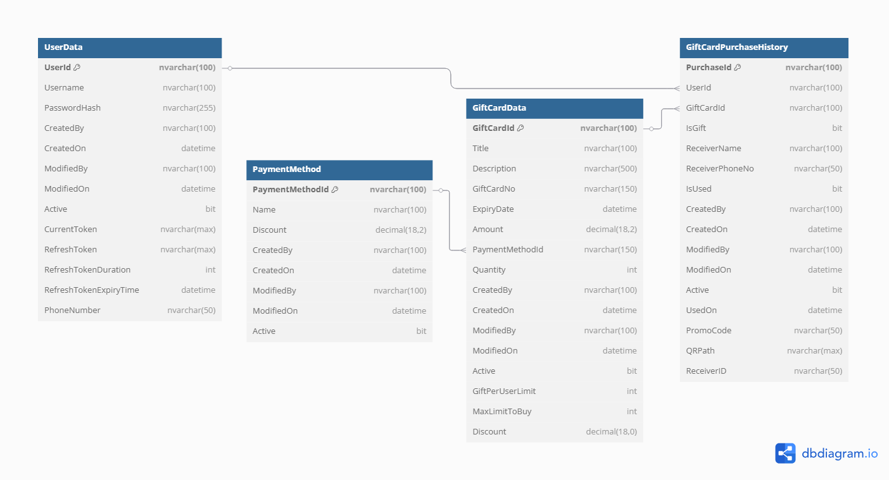


# Gift Card System API

A RESTful API built with **.NET 9**, **Entity Framework Core 9**, and **MSSQL** to manage gift cards, payment methods, promo codes, and purchases. It supports **JWT authentication**, **QR code generation**, and uses **Serilog** for logging. API testing is supported via **Swagger**.

---

## 🔧 Tech Stack & Features

- **.NET 9** & **Entity Framework Core 9**
- **MSSQL** as the database
- **JWT Authentication** for secure API access
- **Serilog** for logging  
  - Logs saved under: `Log/log-YYYY-MM-DD - HH tt`
- **QR Code Generation**  
  - QR codes saved under: `wwwroot/qrcodes`
- **Swagger** (or any other API testing tool) used for API testing

---

## 📌 API Testing Flow

### 1. 🧾 Register a User
- **Endpoint**: `registerUser`
- **Purpose**: Register a new user and receive a JWT access token

### 2. 🔐 Generate Access Token
- **Endpoint**: `GenerateToken`
- **Purpose**: Authenticate and retrieve a JWT token for secured API access

### 3. 💳 Create Payment Method
- **Endpoint**: `CreateOrEditPaymentMethod`
- **Purpose**: Create or update a payment method (requires JWT token)

### 4. 🎁 Gift Card Management
- **Endpoints**:
  - `getAllGiftCards` – Get a list of all gift cards
  - `getGiftCardWithGiftCardID` – Fetch a specific gift card by its ID
  - `CreateOrEditGiftCard` – Create a new or update an existing gift card
  - `DeactivateGiftCard` – Deactivate a specific gift card

### 5. 🛒 Purchase Gift Card & Promo Code Handling
- **Endpoints**:
  - `GetAllPayment` – List all payment records
  - `PurchaseGiftCard` – Purchase a gift card
  - `VerifyPromoCode` – Validate a promo code
  - `UsePromoCode` – Apply a promo code to a purchase
  - `UnUsedGiftCard` – Get all unused gift cards
  - `UsedGiftCard` – Get all used gift cards

---

## 🚀 Getting Started

1. Clone the repository
2. Update connection string in `appsettings.json`
3. Run the project
4. Use Swagger to explore and test the APIs

---

## 🔒 Authentication

All protected endpoints require a valid **JWT token** passed in the `Authorization` header as:

Bearer {your_token_here}

